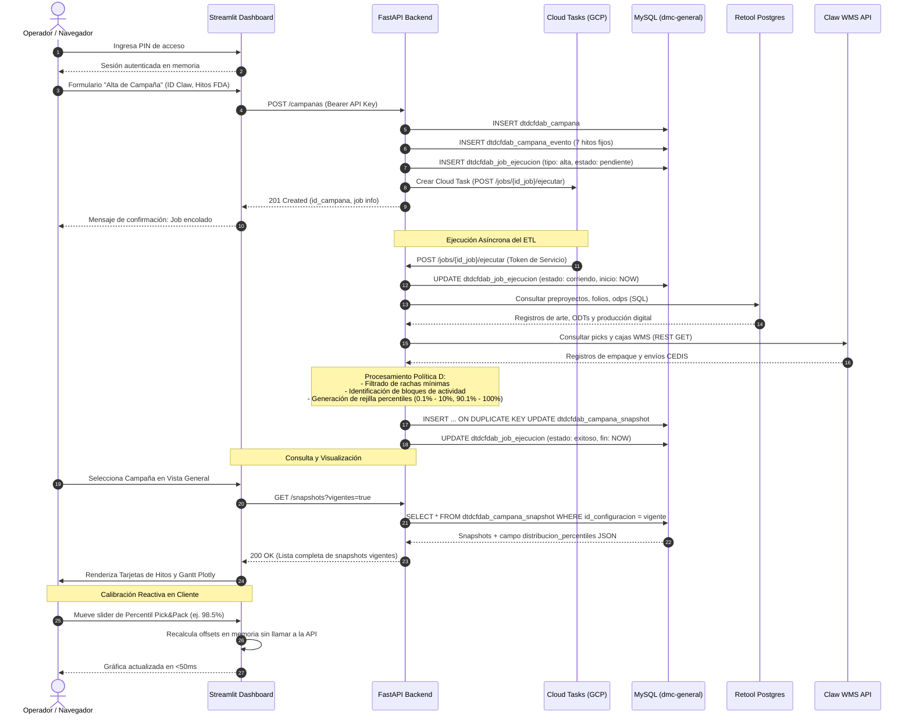

# ARQUITECTURA TÉCNICA DEL SISTEMA DTDCFDAB
**Proyecto:** Dashboard Total de Campaña FDA - Buho  
**Monorepo:** `[Admin] Dashboard total de campaña FDA - Buho`  
**Fecha de corte:** 2026-09-18  
**Versión de arquitectura:** v1.2 (Soporte Percentiles de Alta Resolución 0.1%)

---

## 1. Qué es y qué hace

### 1.1 Propósito y Alcance
El sistema **DTDCFDAB** (*Dashboard Total de Campaña FDA - Buho*) es una plataforma de análisis, consolidación métrica y visualización del ciclo de vida de las campañas operativas para Farmacias del Ahorro (FDA). Sustituye un conjunto previo de hojas de cálculo de Google Sheets frágiles y manuales por una arquitectura moderna de microservicios desacoplada, con procesamiento asíncrono y persistencia centralizada.

El sistema rastrea los tiempos transcurridos, demoras y eficiencias a lo largo de las 7 etapas de cada campaña:
1. **Carga de Artes** (Creatividad y pre-prensa)
2. **Carga de Preproyectos** (Planificación de folios y distribución)
3. **Aprobaciones** (Revisión técnica de preproyectos y ODTs)
4. **Impresión** (Generación de ODPs en planta)
5. **Precampaña** (Etiquetado y habilitado de materiales)
6. **Pick & Pack** (Armado de cajas y surtido en CEDIS)
7. **Entregas** (Distribución de última milla a sucursales FDA)

### 1.2 Responsabilidades Centrales
- **Consolidación ETL Determinista (Política D):** Extracción, saneamiento y cálculo de fechas límite y métricas operativas a partir de fuentes heterogéneas (Retool Digital Postgres y Claw WMS).
- **Procesamiento Cuantílico de Alta Resolución:** Motor estadístico que calcula una rejilla de percentiles con saltos de 0.1% (100 puntos en cola de inicio 0.1% a 10.0% y 100 puntos en cola de fin 90.1% a 100.0%) para Pick & Pack y Entregas, permitiendo calibración reactiva instantánea en el frontend sin reconsultar el backend.
- **Auditoría y Reprocesamiento de Jobs:** Orquestación asíncrona tolerante a fallos mediante Google Cloud Tasks, registrando trazabilidad completa por ejecución y por lote en base de datos.
- **Visualización Analítica Segura:** Dashboard interactivo en Streamlit con protección de acceso mediante PIN, análisis de desviaciones cronológicas contra promedios históricos y diagramas de Gantt interactivos en Plotly.

### 1.3 Decisiones Clave de Diseño
- **Desacoplamiento Estricto de 3 Capas:**
  - `DTDCFDAB - DB`: Capa de datos pura (SQLAlchemy + Alembic). Ningún otro componente gestiona esquemas ni migraciones.
  - `DTDCFDAB - API`: Capa de negocio e integración (FastAPI). Único componente con credenciales para comunicarse con la base de datos de producción, Retool, Claw y Cloud Tasks.
  - `DTDCFDAB - Dashboard`: Cliente delgado (Streamlit). No tiene acceso directo a bases de datos ni llaves de infraestructura; consume exclusivamente la API mediante HTTP autenticado.
- **Snapshot Inmutable por Configuración:** Las tablas operativas no almacenan estados intermedios ni cálculos "en vivo" no reproducibles; cada corrida genera una fila consolidada en `dtdcfdab_campana_snapshot` vinculada a una versión de `dtdcfdab_configuracion`. Si cambian los parámetros de la Política D, se genera una nueva configuración y se recalcula el snapshot.
- **Invisibilidad Git Quirúrgica:** Toda la orquestación de agentes IA (`AGENTS.md`, `SKILL.md`, specs, plans) se aísla localmente en `.git/info/exclude` sin ensuciar el `.gitignore` público del repositorio.

---

## 2. Diagrama de Procesos (Mermaid)

El siguiente diagrama ilustra el flujo de información entre las cuatro swimlanes del ecosistema:

```mermaid
flowchart LR
    subgraph Fuentes["1. Fuentes Externas / Entrada"]
        OP["Operador / Usuario"]
        RET["Retool Digital (PostgreSQL)"]
        CLW["Claw WMS (REST API)"]
    end

    subgraph Presentacion["2. Capa de Presentación (Streamlit)"]
        GATE["Gate de Acceso (PIN)"]
        NAV["Navegación Multipágina (views/)"]
        SEL["Selector de Campañas"]
        PLOT["Renderizador Plotly (charts.py)"]
        CALIB["Calibrador Reactivo (Percentiles en Memoria)"]
    end

    subgraph Negocio["3. Capa de Negocio y Orquestación (FastAPI)"]
        ROUT["Routers (/campanas, /jobs, /snapshots)"]
        JOBM["Servicio de Jobs (jobs.py)"]
        ETL["Motor Política D (snapshot_campana.py)"]
        CT["Google Cloud Tasks (Asíncrono)"]
    end

    subgraph Persistencia["4. Persistencia y Salida (MySQL)"]
        T_CAMP["dtdcfdab_campana"]
        T_EVT["dtdcfdab_evento"]
        T_CEVT["dtdcfdab_campana_evento"]
        T_CFG["dtdcfdab_configuracion"]
        T_SNAP["dtdcfdab_campana_snapshot"]
        T_JOB["dtdcfdab_job_ejecucion"]
    end

    OP -->|Ingresa PIN / Navega| GATE
    GATE --> NAV
    NAV --> SEL
    SEL -->|HTTP GET /snapshots| ROUT
    NAV -->|HTTP POST /campanas| ROUT

    ROUT --> JOBM
    JOBM -->|Registra job pendiente| T_JOB
    JOBM -->|Despacha tarea HTTP| CT

    CT -->|Ejecuta POST /jobs/{id}/ejecutar| JOBM
    JOBM -->|Marca job corriendo| T_JOB
    JOBM --> ETL

    ETL -->|Lee folios, ODTs, ODPs| RET
    ETL -->|Lee recepciones y cajas| CLW
    ETL -->|Lee hitos manuales| T_CEVT
    ETL -->|Lee parámetros| T_CFG

    ETL -->|Calcula Política D + Percentiles 0.1%| JOBM
    JOBM -->|Persiste Snapshot| T_SNAP
    JOBM -->|Marca job exitoso / fallido| T_JOB

    ROUT -->|Retorna Snapshots + JSON Percentiles| SEL
    SEL --> CALIB
    CALIB --> PLOT
    PLOT --> OP
```

---

## 3. Diagrama de Secuencia (Mermaid)

Flujo secuencial completo desde el alta de una campaña hasta la visualización y calibración reactiva:



---

## 4. Conexiones y Sistemas Relacionados

| Sistema / Componente | Propósito | Protocolo / Driver | Autenticación | Variables de Entorno Clave | Manejo de Fallos / Resiliencia |
| :--- | :--- | :--- | :--- | :--- | :--- |
| **MySQL Digital Ocean** (`dmc-general`) | Almacén relacional principal (6 tablas operativas). | PyMySQL / SQLAlchemy 2.0 (TLS puerto 25060) | Usuario / Password con SSL CA | `DATABASE_URL` | Pool de conexiones `QueuePool` (tamaño 5, overflow 10, recycle 1800s). Rollback automático en excepciones. |
| **Retool Digital Database** | Origen de datos para folios, ODTs, artes y ODPs digitales. | psycopg2 / SQLAlchemy (PostgreSQL remoto) | Usuario / Password SSL | `RETOOL_DIGITAL_DB_URL` | Consultas filtradas por `id_claw`. Si falla la conexión, el job se marca como `fallido` con volcado en `error_mensaje`. |
| **Claw WMS API** | Origen de datos para empaque en cajas y guías de envío en CEDIS. | HTTPS / REST (JSON) | Bearer Token / API Key | `CLAW_API_URL`, `CLAW_API_KEY` | Cliente HTTP con timeout configurable (15s). Manejo de respuestas 404/vacías como datasets sin picks. |
| **Google Cloud Tasks** | Cola de despacho asíncrono para no saturar HTTP ni bloquear el dashboard. | gRPC / Google Cloud Client SDK | Google IAM (ADC / Service Account) | `GCP_PROJECT_ID`, `GCP_LOCATION`, `GCP_QUEUE_NAME`, `API_PUBLIC_BASE_URL` | Encolamiento con deduplicación y reintentos automáticos gestionados por infraestructura GCP. |
| **Google Cloud Run** | Infraestructura serverless de alojamiento para la API. | HTTPS / HTTP2 | IAM / Token de servicio / API Key de aplicación | Variables inyectadas por Secret Manager | Autoescalado 0..N instancias. Conectado a VPC privada mediante IP estática fija para salida por NAT. |
| **Streamlit Community Cloud** | Hosting serverless de la interfaz gráfica de usuario. | HTTPS | PIN de usuario en session_state | Secretos inyectados en `.streamlit/secrets.toml` | Reinicio de sesión ante desconexión; cacheo `st.cache_data` con TTL corto para reducir carga sobre la API. |

---

## 5. Variables de Entorno y Secretos

### 5.1 `DTDCFDAB - DB`
| Variable | Tipo | ¿Es Secreto? | Propósito | Entorno / Ubicación |
| :--- | :--- | :---: | :--- | :--- |
| `DATABASE_URL` | String (URI) | Sí | Cadena de conexión SQLAlchemy para Alembic (`mysql+pymysql://...`). | Archivo `.env` local / Secret Manager |

### 5.2 `DTDCFDAB - API`
| Variable | Tipo | ¿Es Secreto? | Propósito | Entorno / Ubicación |
| :--- | :--- | :---: | :--- | :--- |
| `DATABASE_URL` | String (URI) | Sí | Conexión al pool SQLAlchemy de `dmc-general`. | Secret Manager (`prod-redes-y-servicios`) |
| `RETOOL_DIGITAL_DB_URL` | String (URI) | Sí | Conexión de solo lectura a Postgres de Retool Digital. | Secret Manager |
| `CLAW_API_URL` | String (URL) | No | Endpoint base del microservicio Claw WMS. | Variables de entorno Cloud Run |
| `CLAW_API_KEY` | String | Sí | Llave de autenticación para consultar Claw WMS. | Secret Manager |
| `API_KEY` | String | Sí | Llave maestra compartida que exige la API a sus clientes. | Secret Manager |
| `API_PUBLIC_BASE_URL` | String (URL) | No | URL pública del servicio Cloud Run utilizada por Cloud Tasks para callbacks. | Variables de entorno Cloud Run |
| `GCP_PROJECT_ID` | String | No | ID del proyecto GCP (`prod-apps-y-computo`). | Variables de entorno Cloud Run |
| `GCP_LOCATION` | String | No | Región GCP de Cloud Tasks (`us-central1`). | Variables de entorno Cloud Run |
| `GCP_QUEUE_NAME` | String | No | Nombre de la cola de tareas (`cola-jobs-dtdcfdab`). | Variables de entorno Cloud Run |
| `PUERTO` | Integer | No | Puerto de escucha para el servidor Uvicorn (default: 8080). | Variables de entorno Cloud Run |

### 5.3 `DTDCFDAB - Dashboard`
| Variable / Secreto | Tipo | ¿Es Secreto? | Propósito | Entorno / Ubicación |
| :--- | :--- | :---: | :--- | :--- |
| `api.base_url` | String (URL) | No | URL de la API Cloud Run consumida por el cliente HTTP. | `.streamlit/secrets.toml` / Secrets Cloud |
| `api.api_key` | String | Sí | Llave enviada en header `x-api-key` para autorizar llamadas. | `.streamlit/secrets.toml` / Secrets Cloud |
| `auth.pin` | String | Sí | Clave numérica de 4-6 dígitos requerida para acceder al dashboard. | `.streamlit/secrets.toml` / Secrets Cloud |

---

## 6. Contratos de Integración y Endpoints (API)

Todos los endpoints requieren el header HTTP `x-api-key: <API_KEY>` (a excepción de `/health`).

### 6.1 Catálogo de Endpoints
| Método | Ruta | Parámetros / Request Body | Response Body | Códigos HTTP |
| :--- | :--- | :--- | :--- | :--- |
| `GET` | `/health` | Ninguno | `{"status": "ok", "timestamp": "..."}` | 200 |
| `GET` | `/campanas` | Ninguno | `[CampanaOut, ...]` | 200 |
| `GET` | `/campanas/{id_campana}` | `id_campana` (path, int) | `CampanaOut` | 200, 404 |
| `POST` | `/campanas` | `CampanaCreate` (JSON) | `{"campana": CampanaOut, "job": JobOut}` | 201, 400, 409 |
| `DELETE` | `/campanas/{id_campana}` | `id_campana` (path, int) | `{"ok": true}` | 200, 404 |
| `GET` | `/campanas/disponibles` | Ninguno | `[CampanaDisponibleClaw, ...]` | 200, 502 |
| `GET` | `/eventos` | Ninguno | `[EventoOut, ...]` | 200 |
| `GET` | `/campanas/{id_campana}/eventos` | `id_campana` (path, int) | `[CampanaEventoOut, ...]` | 200, 404 |
| `PUT` | `/campanas/{id_campana}/eventos` | `id_campana` (path), `dict[str, date]` | `[CampanaEventoOut, ...]` | 200, 400, 404 |
| `GET` | `/configuracion/vigente` | Ninguno | `ConfiguracionOut` | 200, 404 |
| `POST` | `/configuracion` | `ConfiguracionCreate` (JSON) | `ConfiguracionOut` | 201, 400 |
| `GET` | `/snapshots` | `vigentes=true` (query, bool obligatorio) | `[SnapshotOut, ...]` | 200, 422 |
| `GET` | `/campanas/{id_campana}/snapshot` | `id_campana` (path), `id_configuracion` (opt) | `SnapshotOut` | 200, 404 |
| `POST` | `/jobs` | `JobCreate` (JSON: id_campana, tipo) | `JobOut` | 201, 400 |
| `POST` | `/jobs/lote` | `JobLoteCreate` (JSON: ids_campanas) | `{"id_lote": str, "jobs": [JobOut]}` | 201, 400 |
| `GET` | `/jobs/{id_job}` | `id_job` (path, int) | `JobOut` | 200, 404 |
| `POST` | `/jobs/{id_job}/ejecutar` | `id_job` (path, int) | `JobOut` | 200, 404, 500 |
| `GET` | `/jobs/resumen` | Ninguno | `{"activos": [...], "fallidos": [...], "exitosos": [...]}` | 200 |
| `POST` | `/jobs/reintentar-fallidos` | Ninguno | `{"reintentados": int, "jobs": [JobOut]}` | 200 |

### 6.2 Esquemas Pydantic Clave
- **`SnapshotOut`:**
  - 14 Fechas de etapas: `inicio_carga_artes`, `fin_carga_artes`, `inicio_carga_preproyectos`, `fin_carga_preproyectos`, `inicio_aprobaciones`, `fin_aprobaciones`, `inicio_impresion`, `fin_impresion`, `inicio_precampana`, `fin_precampana`, `inicio_pick_pack`, `fin_pick_pack`, `inicio_entregas`, `fin_entregas`.
  - 13 Métricas operativas: `porcentaje_alcanzado_entregas`, `ultima_entrega`, `numero_envios`, `envios_con_fecha`, `envios_sin_fecha`, `envios_sin_registro_entrega`, `numero_cajas_pick_pack`, `numero_folios`, `numero_odps`, `numero_actividades`, `respuesta_buho_dias`, `respuesta_fda_dias`, `folios_invertidos`.
  - **Rejilla Percentiles (`distribucion_percentiles`):** Objeto JSON estructurado con llaves `pick_pack` y `entregas`. Cada una contiene sub-diccionarios `inicio` (100 cuantiles de 0.001 a 0.100) y `fin` (100 cuantiles de 0.901 a 1.000) con sus marcas de tiempo ISO correspondientes.

---

## 7. Manual de Operación Local y Despliegue

### 7.1 Requisitos Previos
- Python 3.11 o superior.
- Acceso de red a la base de datos Digital Ocean (requiere IP autorizada en DO o túnel).
- Variables de entorno configuradas en cada módulo.

### 7.2 Ejecución Local de Servicios

#### Base de Datos (Alembic)
```bash
cd "DTDCFDAB - DB"
# Ejecutar migraciones pendientes a la versión más reciente
alembic upgrade head

# Ver historial y estado actual de migraciones
alembic current
alembic history --verbose
```

#### API Backend (FastAPI)
```bash
cd "DTDCFDAB - API"
# Instalar dependencias
pip install -r requirements.txt

# Ejecutar servidor de desarrollo con autoreload
uvicorn main:app --host 0.0.0.0 --port 8080 --reload
```

#### Dashboard Frontend (Streamlit)
```bash
# Ubicado en la raíz del monorepo (usa el requirements.txt de la raíz)
pip install -r requirements.txt

cd "DTDCFDAB - Dashboard"
# Ejecutar aplicación Streamlit
streamlit run app.py --server.port 8501
```

### 7.3 Ejecución de Pruebas Automatizadas
Para ejecutar la suite completa de 259 pruebas unitarias e integradas:

```powershell
# Pruebas de DB (14 tests)
cd "DTDCFDAB - DB"
pytest -v

# Pruebas de API (141 tests)
cd "..\DTDCFDAB - API"
pytest -v

# Pruebas de Dashboard (104 tests)
cd "..\DTDCFDAB - Dashboard"
pytest -v
```

### 7.4 Procedimiento de Despliegue en Producción

#### Despliegue de API en Google Cloud Run
El despliegue está automatizado vía Google Cloud Build con triggers vinculados al repositorio Git.
1. Al hacer push a `main` con cambios en `DTDCFDAB - API/**`, Cloud Build ejecuta el pipeline declarado en `DTDCFDAB - API/cloudbuild.yaml`.
2. Se construye la imagen de contenedor Docker utilizando Kaniko/Cloud Build Cache.
3. Se despliega una nueva revisión en Cloud Run bajo el servicio `dtdc-fda-buho-api` en la región `us-central1`, inyectando secretos desde Secret Manager (`prod-redes-y-servicios`) y conectándose a la VPC `prod-apps-vpc-temp` con salida por IP fija (`34.9.186.38`).

#### Despliegue del Dashboard en Streamlit Community Cloud
El despliegue está vinculado a la rama `main` de GitHub.
1. **Decisión Arquitectónica 3A:** Streamlit Community Cloud está configurado con la raíz del monorepo como directorio de ejecución (`Main file path: DTDCFDAB - Dashboard/app.py`).
2. Utiliza estrictamente el archivo `requirements.txt` ubicado en la raíz del monorepo, evitando conflictos de dependencias en submódulos anidados.
3. Los secretos de acceso (`api.base_url`, `api.api_key`, `auth.pin`) se administran desde el panel de configuración de Secrets de Streamlit Cloud.
